## 作业

> 分值：300
>
> 题目描述：
>
> 使用 sysbench、go-ycsb 和 go-tpc 分别对
> TiDB 进行测试并且产出测试报告。
>
> 测试报告需要包括以下内容：
>
> * 部署环境的机器配置(CPU、内存、磁盘规格型号)，拓扑结构(TiDB、TiKV 各部署于哪些节点)
> * 调整过后的 TiDB 和 TiKV 配置
> * 测试输出结果
> * 关键指标的监控截图
>   * TiDB Query Summary 中的 qps 与 duration
>   * TiKV Details 面板中 Cluster 中各 server 的 CPU 以及 QPS 指标
>   * TiKV Details 面板中 grpc 的 qps 以及 duration
>
> 输出：写出你对该配置与拓扑环境和 workload 下 TiDB 集群负载的分析，提出你认为的 TiDB 的性能的瓶颈所在(能提出大致在哪个模块即 可)
>
> 截止时间：下周二（8.25）24:00:00(逾期提交不给分)


## 部署环境的机器配置

#### 服务器为3台相同配置的虚拟机相关配置为

| 配置   | 参数          |
| ------ | ------------- |
| 处理器 | 8核           |
| 内存   | 16GB          |
| 硬盘   | 500G 机械硬盘 |
| 网卡   | 1000M         |


#### 部署结构

| 服务器        | 组件                                                         |
| ------------- | ------------------------------------------------------------ |
| 10.204.49.100 | TiUP<br>Promethus<br>TiDB1<br>PD1<br>TiKV1<br>PUMP1<br>Drainer |
| 10.204.49.101 | TiDB2<br/>PD2<br/>TiKV2<br/>PUMP2                            |
| 10.204.49.102 | TiDB3<br/>PD3<br/>TiKV3<br/>PUMP3                            |


## 调整过后的tidb和tikv配置

>  这里展示部分inventory.init数据。  使用默认的tikv和tidb配置未修改配置

```
[tidb_servers]
TiDB1 ansible_host=10.204.49.100 deploy_dir=/data/deploy/TiDB1
TiDB2 ansible_host=10.204.49.101 deploy_dir=/data/deploy/TiDB2
TiDB3 ansible_host=10.204.49.102 deploy_dir=/data/deploy/TiDB3

[tikv_servers]
TiKV1 ansible_host=10.204.49.100 deploy_dir=/data/deploy/TiKV1 tikv_port=20171 labels="host=tikv1"
TiKV2 ansible_host=10.204.49.101 deploy_dir=/data/deploy/TiKV2 tikv_port=20171 labels="host=tikv2"
TiKV3 ansible_host=10.204.49.102 deploy_dir=/data/deploy/TiKV3 tikv_port=20171 labels="host=tikv3"

[pd_servers]
PD1 ansible_host=10.204.49.100 deploy_dir=/data/deploy/PD1
PD2 ansible_host=10.204.49.101 deploy_dir=/data/deploy/PD2
PD3 ansible_host=10.204.49.102 deploy_dir=/data/deploy/PD3

[monitoring_servers]
10.204.49.100

[grafana_servers]
10.204.49.100

# node_exporter and blackbox_exporter servers
[monitored_servers]
10.204.49.100
10.204.49.101
10.204.49.102

[alertmanager_servers]
10.204.49.100

[kafka_exporter_servers]

## Binlog Part
[pump_servers]
PUMP1 ansible_host=10.204.49.100 deploy_dir=/data/deploy/PUMP1
PUMP2 ansible_host=10.204.49.101 deploy_dir=/data/deploy/PUMP2
PUMP3 ansible_host=10.204.49.102 deploy_dir=/data/deploy/PUMP3

enable_binlog = True
enable_dev=true
```


## 测试集群

### sysbench安装与测试

https://github.com/akopytov/sysbench

##### cento上安装sysbench

```
curl -s https://packagecloud.io/install/repositories/akopytov/sysbench/script.rpm.sh | sudo bash
sudo yum -y install sysbench
```


##### 检查安装情况

```
[appdeploy@sit-tidb-mysql-vl-01:/home/appdeploy]#sysbench --version
sysbench 1.0.20
```


##### 下载tidb官方二次包装的压力测试工具

```
git clone https://github.com/pingcap/tidb-bench.git
```


##### 修改并且执行sysbench

调整配置

```
[appdeploy@sit-tidb-mysql-vl-01:/data]#cd tidb-bench/
[appdeploy@sit-tidb-mysql-vl-01:/data/tidb-bench]#ls
abm  docker  LICENSE  README.md  sql-bench  ssb  sysbench  tpcds  tpch
[appdeploy@sit-tidb-mysql-vl-01:/data/tidb-bench]#cd sysbench/
[appdeploy@sit-tidb-mysql-vl-01:/data/tidb-bench/sysbench]#ls
config  oltp_insert_ignore.lua  README.md  run.sh  sysbench-patch
[appdeploy@sit-tidb-mysql-vl-01:/data/tidb-bench/sysbench]#cat run.sh
#!/bin/bash

if [[ $# -ne 3 ]]
then
  echo "usage: run.sh [test name] [prepare/run/help] [threads]"
  echo "       e.g. run.sh point_select prepare 16"
  exit 1
fi

sysbench --config-file=config --threads=$3 oltp_$1 --tables=1 --table_size=1 $2 > $1_$2_$3.log 2>&1
[appdeploy@sit-tidb-mysql-vl-01:/data/tidb-bench/sysbench]#ls
config  oltp_insert_ignore.lua  README.md  run.sh  sysbench-patch
[appdeploy@sit-tidb-mysql-vl-01:/data/tidb-bench/sysbench]#cat config
time=300
db-driver=mysql
mysql-host=10.204.49.100
mysql-port=4000
mysql-user=root
mysql-db=sbtest
report-interval=10
```

##### 执行数据导入语句

```shell
[appdeploy@sit-tidb-mysql-vl-01:/data/tidb-bench/sysbench]#sysbench --config-file=config oltp_update_non_index  --threads=32 --tables=32 --table_size=100000 prepare
```

##### 在`/usr/share/sysbench`下有不同的压测场景

```shell
[appdeploy@sit-tidb-mysql-vl-01:/data/tidb-bench/sysbench]#ls /usr/share/sysbench
bulk_insert.lua  oltp_delete.lua  oltp_point_select.lua  oltp_read_write.lua    oltp_update_non_index.lua  select_random_points.lua  tests oltp_common.lua  oltp_insert.lua  oltp_read_only.lua  oltp_update_index.lua  oltp_write_only.lua select_random_ranges.lua
```


##### point get测试

```
sysbench --config-file=config oltp_point_select  --threads=32 --tables=32 --table_size=100000 run
```

##### Insert 测试

```
sysbench --config-file=config oltp_insert  --threads=16 --tables=32 --table_size=100000 run
```

##### read_write 测试

```
sysbench --config-file=config oltp_read_write  --threads=16 --tables=32 --table_size=100000 run
```


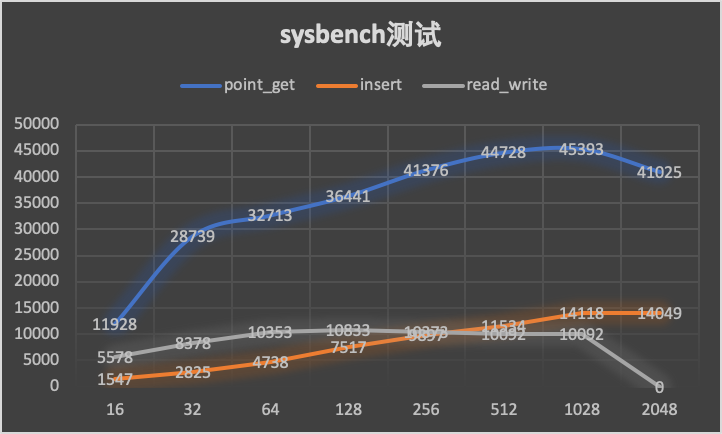

##### 关键指标

- TiDB Query Summary 中的 qps 与 duration

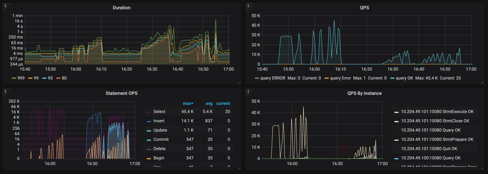

- TiKV Details 面板中 Cluster 中各 server 的 CPU 以及 QPS 指标

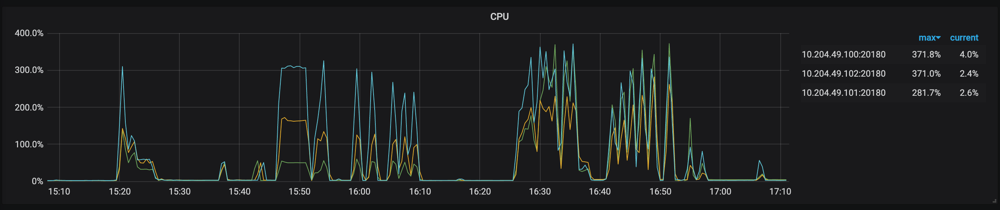

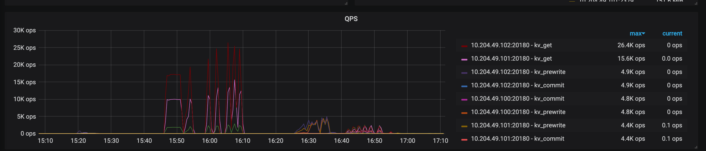

- TiKV Details 面板中 grpc 的 qps 以及 duration

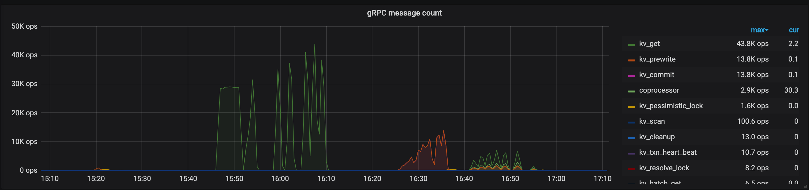

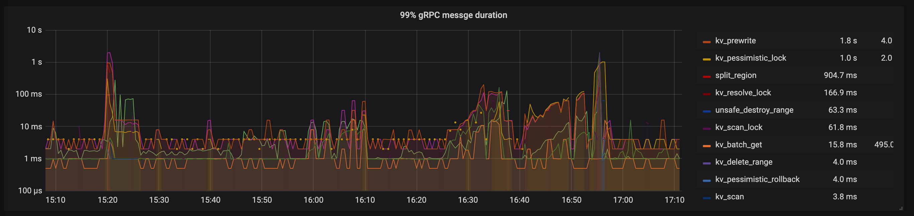


### GO YCSB 压力测试

##### 从线上下载git,并且安装

```
[appdeploy@sit-tidb-mysql-vl-01:/data]#git clone https://github.com/pingcap/go-ycsb.git
正克隆到 'go-ycsb'...
remote: Enumerating objects: 5017, done.
remote: Total 5017 (delta 0), reused 0 (delta 0), pack-reused 5017
接收对象中: 100% (5017/5017), 8.49 MiB | 46.00 KiB/s, done.
处理 delta 中: 100% (1907/1907), done.
[root@sit-tidb-mysql-vl-01:/data/go-ycsb]#make
go build -o bin/go-ycsb cmd/go-ycsb/*
```


##### 运行数据加载

```
[root@sit-tidb-mysql-vl-01:/data/go-ycsb]#bin/go-ycsb load mysql -P workloads/workloadb -p recordcount=5000000 -p mysql.host=10.204.49.101 -p mysql.port=4000 -p operationcount=2048  --threads 2048
***************** properties *****************
"dotransactions"="false"
"recordcount"="5000000"
"updateproportion"="0.05"
"workload"="core"
"mysql.port"="4000"
"readallfields"="true"
"requestdistribution"="uniform"
"mysql.host"="10.204.49.101"
"threadcount"="2048"
"operationcount"="2048"
"insertproportion"="0"
"readproportion"="0.95"
"scanproportion"="0"
**********************************************
INSERT - Takes(s): 10.0, Count: 89645, OPS: 9000.7, Avg(us): 220984, Min(us): 19368, Max(us): 846504, 99th(us): 585000, 99.9th(us): 743000, 99.99th(us): 800000
INSERT - Takes(s): 20.0, Count: 176414, OPS: 8839.2, Avg(us): 228385, Min(us): 19368, Max(us): 1048064, 99th(us): 826000, 99.9th(us): 1000000, 99.99th(us): 1020000
INSERT - Takes(s): 30.0, Count: 258083, OPS: 8614.9, Avg(us): 235212, Min(us): 19368, Max(us): 1048064, 99th(us): 688000, 99.9th(us): 989000, 99.99th(us): 1019000
INSERT - Takes(s): 40.0, Count: 330814, OPS: 8279.1, Avg(us): 245403, Min(us): 19368, Max(us): 1048064, 99th(us): 695000, 99.9th(us): 984000, 99.99th(us): 1020000
INSERT - Takes(s): 50.0, Count: 400422, OPS: 8015.2, Avg(us): 253845, Min(us): 19368, Max(us): 1048064, 99th(us): 683000, 99.9th(us): 979000, 99.99th(us): 1019000
INSERT - Takes(s): 60.0, Count: 479560, OPS: 7998.2, Avg(us): 254645, Min(us): 19368, Max(us): 1210910, 99th(us): 671000, 99.9th(us): 972000, 99.99th(us): 1018000
INSERT - Takes(s): 70.0, Count: 563074, OPS: 8048.7, Avg(us): 253263, Min(us): 19368, Max(us): 1210910, 99th(us): 659000, 99.9th(us): 961000, 99.99th(us): 1016000
INSERT - Takes(s): 80.0, Count: 649905, OPS: 8128.1, Avg(us): 250971, Min(us): 19368, Max(us): 1210910, 99th(us): 640000, 99.9th(us): 952000, 99.99th(us): 1017000
```


##### 使用workloada

```
[root@sit-tidb-mysql-vl-01:/data/go-ycsb]#bin/go-ycsb run mysql -P workloads/workloada  -p mysql.host=10.204.49.101 -p mysql.port=4000 -p operationcount=10000000  --threads 256
***************** properties *****************
"mysql.port"="4000"
"dotransactions"="true"
"scanproportion"="0"
"operationcount"="10000000"
"workload"="core"
"updateproportion"="0.5"
"recordcount"="1000"
"readproportion"="0.5"
"readallfields"="true"
"mysql.host"="10.204.49.101"
"insertproportion"="0"
"requestdistribution"="uniform"
"threadcount"="256"
**********************************************
READ   - Takes(s): 10.0, Count: 39821, OPS: 3985.1, Avg(us): 11823, Min(us): 1422, Max(us): 265807, 99th(us): 103000, 99.9th(us): 120000, 99.99th(us): 224000
UPDATE - Takes(s): 10.0, Count: 39307, OPS: 3948.0, Avg(us): 52604, Min(us): 14885, Max(us): 1155956, 99th(us): 273000, 99.9th(us): 426000, 99.99th(us): 569000
READ   - Takes(s): 20.0, Count: 80579, OPS: 4030.5, Avg(us): 11719, Min(us): 1422, Max(us): 304394, 99th(us): 103000, 99.9th(us): 121000, 99.99th(us): 259000
UPDATE - Takes(s): 20.0, Count: 79839, OPS: 4000.7, Avg(us): 52013, Min(us): 14885, Max(us): 1155956, 99th(us): 271000, 99.9th(us): 438000, 99.99th(us): 569000
READ   - Takes(s): 30.0, Count: 118197, OPS: 3940.9, Avg(us): 11759, Min(us): 1422, Max(us): 1050798, 99th(us): 103000, 99.9th(us): 120000, 99.99th(us): 273000
UPDATE - Takes(s): 30.0, Count: 117632, OPS: 3926.8, Avg(us): 53259, Min(us): 14236, Max(us): 1155956, 99th(us): 288000, 99.9th(us): 674000, 99.99th(us): 883000
READ   - Takes(s): 40.0, Count: 158573, OPS: 3965.1, Avg(us): 11675, Min(us): 1422, Max(us): 1050798, 99th(us): 103000, 99.9th(us): 120000, 99.99th(us): 283000
UPDATE - Takes(s): 40.0, Count: 157587, OPS: 3944.0, Avg(us): 53064, Min(us): 14236, Max(us): 1155956, 99th(us): 284000, 99.9th(us): 666000, 99.99th(us): 874000
READ   - Takes(s): 50.0, Count: 198985, OPS: 3980.3, Avg(us): 11685, Min(us): 1422, Max(us): 1050798, 99th(us): 103000, 99.9th(us): 120000, 99.99th(us): 282000
UPDATE - Takes(s): 50.0, Count: 198118, OPS: 3965.8, Avg(us): 52747, Min(us): 14236, Max(us): 1155956, 99th(us): 280000, 99.9th(us): 659000, 99.99th(us): 865000
```


##### 使用workloadb

```
[root@sit-tidb-mysql-vl-01:/data/go-ycsb]#bin/go-ycsb run mysql -P workloads/workloadb  -p mysql.host=10.204.49.101 -p mysql.port=4000 -p operationcount=10000000  --threads 256
***************** properties *****************
"readallfields"="true"
"scanproportion"="0"
"recordcount"="1000"
"mysql.host"="10.204.49.101"
"mysql.port"="4000"
"dotransactions"="true"
"threadcount"="256"
"insertproportion"="0"
"workload"="core"
"readproportion"="0.95"
"requestdistribution"="uniform"
"operationcount"="10000000"
"updateproportion"="0.05"
**********************************************
READ   - Takes(s): 10.0, Count: 152165, OPS: 15257.3, Avg(us): 13480, Min(us): 1410, Max(us): 1257732, 99th(us): 86000, 99.9th(us): 123000, 99.99th(us): 620000
UPDATE - Takes(s): 9.9, Count: 8071, OPS: 813.2, Avg(us): 61380, Min(us): 13618, Max(us): 1078054, 99th(us): 563000, 99.9th(us): 693000, 99.99th(us): 817000
READ   - Takes(s): 20.0, Count: 309953, OPS: 15518.2, Avg(us): 13508, Min(us): 1410, Max(us): 1257732, 99th(us): 87000, 99.9th(us): 121000, 99.99th(us): 547000
UPDATE - Takes(s): 19.9, Count: 16403, OPS: 823.2, Avg(us): 55951, Min(us): 13618, Max(us): 1078054, 99th(us): 456000, 99.9th(us): 640000, 99.99th(us): 957000
READ   - Takes(s): 30.0, Count: 463385, OPS: 15459.9, Avg(us): 13713, Min(us): 1410, Max(us): 1257732, 99th(us): 87000, 99.9th(us): 121000, 99.99th(us): 467000
UPDATE - Takes(s): 29.9, Count: 24367, OPS: 814.3, Avg(us): 53760, Min(us): 12092, Max(us): 1078054, 99th(us): 269000, 99.9th(us): 632000, 99.99th(us): 817000
READ   - Takes(s): 40.0, Count: 614723, OPS: 15378.4, Avg(us): 13862, Min(us): 1410, Max(us): 1257732, 99th(us): 86000, 99.9th(us): 121000, 99.99th(us): 254000
UPDATE - Takes(s): 39.9, Count: 32244, OPS: 807.6, Avg(us): 52775, Min(us): 10648, Max(us): 1078054, 99th(us): 250000, 99.9th(us): 626000, 99.99th(us): 730000
```


##### 使用workloadc

```
[root@sit-tidb-mysql-vl-01:/data/go-ycsb]#bin/go-ycsb run mysql -P workloads/workloadc  -p mysql.host=10.204.49.101 -p mysql.port=4000 -p operationcount=10000000  --threads 256
***************** properties *****************
"updateproportion"="0"
"scanproportion"="0"
"mysql.port"="4000"
"threadcount"="256"
"recordcount"="1000"
"requestdistribution"="uniform"
"readproportion"="1"
"mysql.host"="10.204.49.101"
"dotransactions"="true"
"operationcount"="10000000"
"workload"="core"
"insertproportion"="0"
"readallfields"="true"
**********************************************
READ   - Takes(s): 10.0, Count: 198038, OPS: 19814.4, Avg(us): 12868, Min(us): 2036, Max(us): 60026, 99th(us): 35000, 99.9th(us): 44000, 99.99th(us): 55000
READ   - Takes(s): 20.0, Count: 396091, OPS: 19807.9, Avg(us): 12893, Min(us): 1689, Max(us): 60026, 99th(us): 35000, 99.9th(us): 43000, 99.99th(us): 53000
READ   - Takes(s): 30.0, Count: 595680, OPS: 19859.6, Avg(us): 12861, Min(us): 1681, Max(us): 60026, 99th(us): 35000, 99.9th(us): 42000, 99.99th(us): 51000
READ   - Takes(s): 40.0, Count: 790189, OPS: 19757.3, Avg(us): 12936, Min(us): 1588, Max(us): 67053, 99th(us): 35000, 99.9th(us): 44000, 99.99th(us): 57000
READ   - Takes(s): 50.0, Count: 987040, OPS: 19742.9, Avg(us): 12949, Min(us): 1588, Max(us): 67053, 99th(us): 35000, 99.9th(us): 43000, 99.99th(us): 56000
READ   - Takes(s): 60.0, Count: 1184915, OPS: 19750.3, Avg(us): 12946, Min(us): 1588, Max(us): 67053, 99th(us): 35000, 99.9th(us): 43000, 99.99th(us): 55000
READ   - Takes(s): 70.0, Count: 1378998, OPS: 19701.5, Avg(us): 12960, Min(us): 1588, Max(us): 73787, 99th(us): 35000, 99.9th(us): 43000, 99.99th(us): 55000
READ   - Takes(s): 80.0, Count: 1577027, OPS: 19714.1, Avg(us): 12971, Min(us): 1434, Max(us): 227932, 99th(us): 35000, 99.9th(us): 43000, 99.99th(us): 60000
```


##### 使用workloadd

```
[root@sit-tidb-mysql-vl-01:/data/go-ycsb]#bin/go-ycsb run mysql -P workloads/workloadd  -p mysql.host=10.204.49.101 -p mysql.port=4000 -p operationcount=10000000  --threads 256
***************** properties *****************
"updateproportion"="0"
"readproportion"="0.95"
"recordcount"="1000"
"workload"="core"
"scanproportion"="0"
"requestdistribution"="latest"
"mysql.host"="10.204.49.101"
"dotransactions"="true"
"threadcount"="256"
"mysql.port"="4000"
"insertproportion"="0.05"
"operationcount"="10000000"
"readallfields"="true"
**********************************************
INSERT - Takes(s): 10.0, Count: 10178, OPS: 1019.5, Avg(us): 7392, Min(us): 1149, Max(us): 39401, 99th(us): 29000, 99.9th(us): 35000, 99.99th(us): 39000
READ   - Takes(s): 10.0, Count: 189678, OPS: 18981.2, Avg(us): 13021, Min(us): 1764, Max(us): 54938, 99th(us): 36000, 99.9th(us): 43000, 99.99th(us): 47000
INSERT - Takes(s): 20.0, Count: 21211, OPS: 1061.4, Avg(us): 7625, Min(us): 1149, Max(us): 63337, 99th(us): 29000, 99.9th(us): 34000, 99.99th(us): 60000
READ   - Takes(s): 20.0, Count: 399054, OPS: 19959.1, Avg(us): 12377, Min(us): 1735, Max(us): 68815, 99th(us): 35000, 99.9th(us): 43000, 99.99th(us): 62000
INSERT - Takes(s): 30.0, Count: 33269, OPS: 1109.5, Avg(us): 7656, Min(us): 1149, Max(us): 63337, 99th(us): 28000, 99.9th(us): 34000, 99.99th(us): 41000
READ   - Takes(s): 30.0, Count: 627862, OPS: 20932.3, Avg(us): 11797, Min(us): 1735, Max(us): 68815, 99th(us): 34000, 99.9th(us): 42000, 99.99th(us): 61000
INSERT - Takes(s): 40.0, Count: 45395, OPS: 1135.3, Avg(us): 7605, Min(us): 1149, Max(us): 63337, 99th(us): 28000, 99.9th(us): 34000, 99.99th(us): 40000
READ   - Takes(s): 40.0, Count: 861224, OPS: 21534.6, Avg(us): 11463, Min(us): 1477, Max(us): 68815, 99th(us): 33000, 99.9th(us): 41000, 99.99th(us): 59000
INSERT - Takes(s): 50.0, Count: 57628, OPS: 1152.9, Avg(us): 7594, Min(us): 1149, Max(us): 63337, 99th(us): 27000, 99.9th(us): 34000, 99.99th(us): 46000
READ   - Takes(s): 50.0, Count: 1094148, OPS: 21886.3, Avg(us): 11276, Min(us): 1477, Max(us): 68815, 99th(us): 32000, 99.9th(us): 41000, 99.99th(us): 59000
```


##### 使用workloade

```
[root@sit-tidb-mysql-vl-01:/data/go-ycsb]#bin/go-ycsb run mysql -P workloads/workloade  -p mysql.host=10.204.49.101 -p mysql.port=4000 -p operationcount=500000  --threads 256
***************** properties *****************
"workload"="core"
"dotransactions"="true"
"readallfields"="true"
"maxscanlength"="1"
"scanlengthdistribution"="uniform"
"mysql.port"="4000"
"operationcount"="500000"
"readproportion"="0"
"threadcount"="256"
"insertproportion"="0.05"
"requestdistribution"="uniform"
"recordcount"="1000"
"updateproportion"="0"
"mysql.host"="10.204.49.101"
"scanproportion"="0.95"
**********************************************
INSERT - Takes(s): 10.0, Count: 2628, OPS: 263.1, Avg(us): 30715, Min(us): 1403, Max(us): 172056, 99th(us): 98000, 99.9th(us): 151000, 99.99th(us): 173000
SCAN   - Takes(s): 10.0, Count: 48839, OPS: 4888.4, Avg(us): 50291, Min(us): 2767, Max(us): 223038, 99th(us): 125000, 99.9th(us): 179000, 99.99th(us): 216000
INSERT - Takes(s): 20.0, Count: 5229, OPS: 261.6, Avg(us): 30961, Min(us): 1280, Max(us): 172056, 99th(us): 101000, 99.9th(us): 147000, 99.99th(us): 173000
SCAN   - Takes(s): 20.0, Count: 98062, OPS: 4905.4, Avg(us): 50339, Min(us): 2615, Max(us): 228490, 99th(us): 127000, 99.9th(us): 180000, 99.99th(us): 215000
INSERT - Takes(s): 30.0, Count: 7826, OPS: 261.0, Avg(us): 30847, Min(us): 1280, Max(us): 187007, 99th(us): 101000, 99.9th(us): 151000, 99.99th(us): 188000
SCAN   - Takes(s): 30.0, Count: 147225, OPS: 4909.0, Avg(us): 50389, Min(us): 2615, Max(us): 254306, 99th(us): 128000, 99.9th(us): 179000, 99.99th(us): 215000
INSERT - Takes(s): 40.0, Count: 10473, OPS: 261.9, Avg(us): 30492, Min(us): 1280, Max(us): 197263, 99th(us): 100000, 99.9th(us): 148000, 99.99th(us): 188000
SCAN   - Takes(s): 40.0, Count: 196284, OPS: 4908.2, Avg(us): 50447, Min(us): 2615, Max(us): 254306, 99th(us): 127000, 99.9th(us): 177000, 99.99th(us): 215000
```


##### 使用workloadf

```
[root@sit-tidb-mysql-vl-01:/data/go-ycsb]#bin/go-ycsb run mysql -P workloads/workloadf  -p mysql.host=10.204.49.101 -p mysql.port=4000 -p operationcount=500000  --threads 256
***************** properties *****************
"insertproportion"="0"
"scanproportion"="0"
"mysql.host"="10.204.49.101"
"readmodifywriteproportion"="0.5"
"mysql.port"="4000"
"readallfields"="true"
"threadcount"="256"
"dotransactions"="true"
"updateproportion"="0"
"workload"="core"
"readproportion"="0.5"
"operationcount"="500000"
"recordcount"="1000"
"requestdistribution"="uniform"
**********************************************
READ   - Takes(s): 10.0, Count: 61935, OPS: 6197.7, Avg(us): 13221, Min(us): 1509, Max(us): 292531, 99th(us): 105000, 99.9th(us): 123000, 99.99th(us): 231000
READ_MODIFY_WRITE - Takes(s): 9.9, Count: 30585, OPS: 3081.2, Avg(us): 69292, Min(us): 20448, Max(us): 651282, 99th(us): 308000, 99.9th(us): 459000, 99.99th(us): 635000
UPDATE - Takes(s): 9.9, Count: 30587, OPS: 3081.1, Avg(us): 56199, Min(us): 12726, Max(us): 645437, 99th(us): 276000, 99.9th(us): 450000, 99.99th(us): 620000
READ   - Takes(s): 20.0, Count: 126486, OPS: 6326.5, Avg(us): 12904, Min(us): 1457, Max(us): 292746, 99th(us): 105000, 99.9th(us): 123000, 99.99th(us): 229000
READ_MODIFY_WRITE - Takes(s): 19.9, Count: 62808, OPS: 3152.0, Avg(us): 67982, Min(us): 18886, Max(us): 1000532, 99th(us): 303000, 99.9th(us): 463000, 99.99th(us): 631000
UPDATE - Takes(s): 19.9, Count: 62811, OPS: 3152.1, Avg(us): 55151, Min(us): 12726, Max(us): 989908, 99th(us): 275000, 99.9th(us): 447000, 99.99th(us): 612000
```


##### workload含义

| workload | 含义               |
| -------- | ------------------ |
| a        | 更新50%，查询50%   |
| b        | 读95%，更新5%      |
| c        | 读100%             |
| d        | 读95%，写5%        |
| e        | 范围读取95%，写5%  |
| f        | 读更新50%，纯读50% |


##### 关键指标

- TiDB Query Summary 中的 qps 与 duration

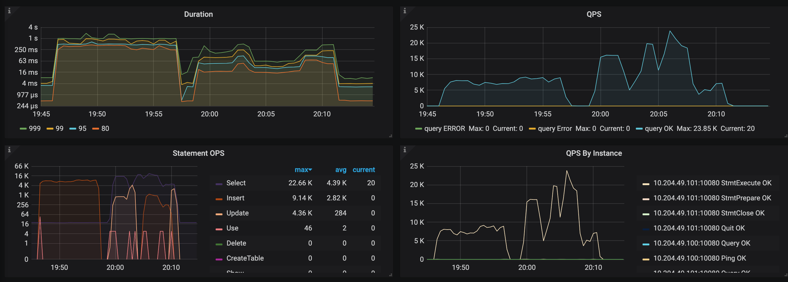

- TiKV Details 面板中 Cluster 中各 server 的 CPU 以及 QPS 指标

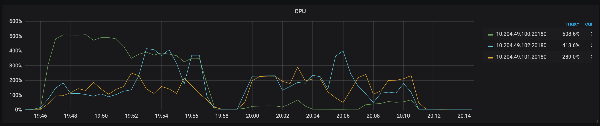

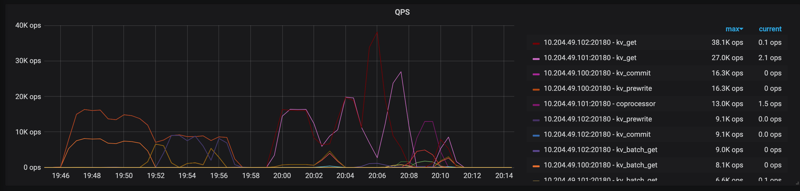

- TiKV Details 面板中 grpc 的 qps 以及 duration

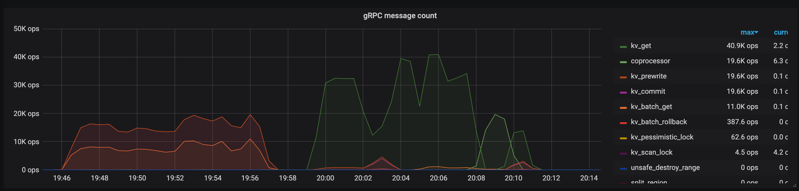

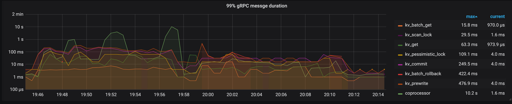


### GO TPC 压力测试

##### 下载并且更新

```
[root@sit-tidb-mysql-vl-01:/data]#git clone https://github.com/pingcap/go-tpc.git
正克隆到 'go-tpc'...
remote: Enumerating objects: 7, done.
remote: Counting objects: 100% (7/7), done.
remote: Compressing objects: 100% (7/7), done.
remote: Total 792 (delta 1), reused 1 (delta 0), pack-reused 785
接收对象中: 100% (792/792), 373.07 KiB | 24.00 KiB/s, done.
处理 delta 中: 100% (451/451), done.
[root@sit-tidb-mysql-vl-01:/data]#cd go-tpc/
[root@sit-tidb-mysql-vl-01:/data/go-tpc]#make
go vet ./...
```


##### 准备数据

>  100个warehouses数据需要准备1一个小时。

```
[appdeploy@sit-tidb-mysql-vl-01:/data/go-tpc]#./bin/go-tpc tpcc  -H 10.204.49.100 -P 4000 -D tpcc --warehouses 100  prepare
```


```
[appdeploy@sit-tidb-mysql-vl-01:/data/go-tpc]#./bin/go-tpc tpcc -H 10.204.49.101 -P 4000 -D tpcc --warehouses 100  run
[Current] NEW_ORDER - Takes(s): 10.0, Count: 68, TPM: 409.2, Sum(ms): 5736, Avg(ms): 84, 90th(ms): 128, 99th(ms): 512, 99.9th(ms): 512
[Current] ORDER_STATUS - Takes(s): 8.5, Count: 4, TPM: 28.2, Sum(ms): 196, Avg(ms): 49, 90th(ms): 80, 99th(ms): 80, 99.9th(ms): 80
[Current] PAYMENT - Takes(s): 9.8, Count: 68, TPM: 415.9, Sum(ms): 2131, Avg(ms): 31, 90th(ms): 48, 99th(ms): 160, 99.9th(ms): 160
[Current] STOCK_LEVEL - Takes(s): 7.2, Count: 3, TPM: 25.0, Sum(ms): 421, Avg(ms): 140, 90th(ms): 256, 99th(ms): 256, 99.9th(ms): 256
[Current] DELIVERY - Takes(s): 4.9, Count: 3, TPM: 36.8, Sum(ms): 388, Avg(ms): 129, 90th(ms): 160, 99th(ms): 160, 99.9th(ms): 160
[Current] NEW_ORDER - Takes(s): 10.0, Count: 77, TPM: 462.7, Sum(ms): 6734, Avg(ms): 87, 90th(ms): 128, 99th(ms): 1000, 99.9th(ms): 1000
[Current] ORDER_STATUS - Takes(s): 9.8, Count: 5, TPM: 30.5, Sum(ms): 197, Avg(ms): 39, 90th(ms): 64, 99th(ms): 64, 99.9th(ms): 64
[Current] PAYMENT - Takes(s): 9.9, Count: 76, TPM: 461.4, Sum(ms): 2095, Avg(ms): 27, 90th(ms): 40, 99th(ms): 128, 99.9th(ms): 128
[Current] STOCK_LEVEL - Takes(s): 7.7, Count: 7, TPM: 54.4, Sum(ms): 489, Avg(ms): 69, 90th(ms): 96, 99th(ms): 96, 99.9th(ms): 96
[Current] DELIVERY - Takes(s): 5.4, Count: 2, TPM: 22.3, Sum(ms): 215, Avg(ms): 107, 90th(ms): 112, 99th(ms): 112, 99.9th(ms): 112
[Current] NEW_ORDER - Takes(s): 10.0, Count: 83, TPM: 498.1, Sum(ms): 6304, Avg(ms): 75, 90th(ms): 128, 99th(ms): 160, 99.9th(ms): 160
[Current] ORDER_STATUS - Takes(s): 5.2, Count: 5, TPM: 57.2, Sum(ms): 215, Avg(ms): 43, 90th(ms): 80, 99th(ms): 80, 99.9th(ms): 80
[Current] PAYMENT - Takes(s): 9.6, Count: 92, TPM: 575.1, Sum(ms): 2866, Avg(ms): 31, 90th(ms): 48, 99th(ms): 160, 99.9th(ms): 160
[Current] STOCK_LEVEL - Takes(s): 8.3, Count: 7, TPM: 50.6, Sum(ms): 267, Avg(ms): 38, 90th(ms): 80, 99th(ms): 80, 99.9th(ms): 80
Got signal [interrupt] to exit.
Finished
[Summary] DELIVERY - Takes(s): 202.6, Count: 92, TPM: 27.2, Sum(ms): 25092, Avg(ms): 272, 90th(ms): 512, 99th(ms): 1000, 99.9th(ms): 1000
[Summary] NEW_ORDER - Takes(s): 203.6, Count: 1152, TPM: 339.4, Sum(ms): 121256, Avg(ms): 105, 90th(ms): 192, 99th(ms): 512, 99.9th(ms): 1000
[Summary] ORDER_STATUS - Takes(s): 200.7, Count: 107, TPM: 32.0, Sum(ms): 7599, Avg(ms): 71, 90th(ms): 128, 99th(ms): 256, 99.9th(ms): 1000
[Summary] PAYMENT - Takes(s): 204.7, Count: 1050, TPM: 307.8, Sum(ms): 37142, Avg(ms): 35, 90th(ms): 64, 99th(ms): 160, 99.9th(ms): 512
[Summary] PAYMENT_ERR - Takes(s): 204.7, Count: 1, TPM: 0.3, Sum(ms): 31, Avg(ms): 31, 90th(ms): 32, 99th(ms): 32, 99.9th(ms): 32
[Summary] STOCK_LEVEL - Takes(s): 201.1, Count: 98, TPM: 29.2, Sum(ms): 12918, Avg(ms): 131, 90th(ms): 256, 99th(ms): 512, 99.9th(ms): 512
tpmC: 339.4
```


##### 关键指标

- TiDB Query Summary 中的 qps 与 duration

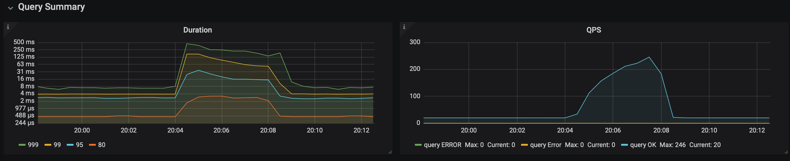

- TiKV Details 面板中 Cluster 中各 server 的 CPU 以及 QPS 指标

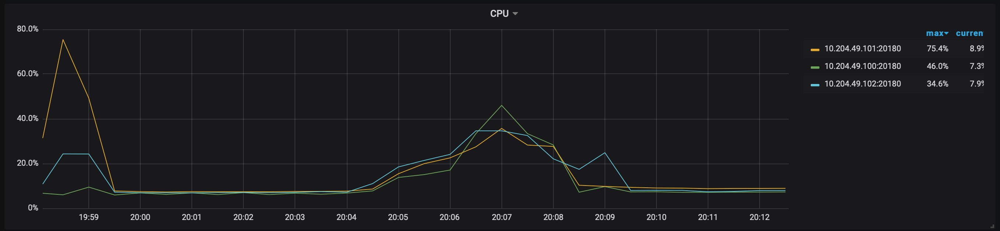

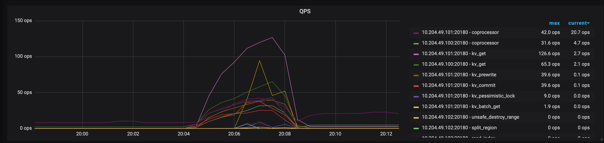

- TiKV Details 面板中 grpc 的 qps 以及 duration

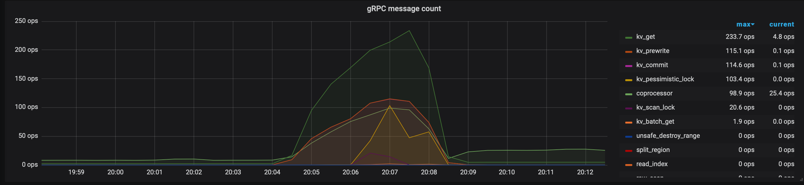

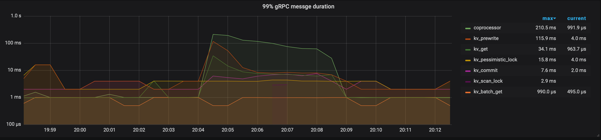

##### 准备tpch数据

```
[appdeploy@sit-tidb-mysql-vl-01:/data/go-tpc]#./bin/go-tpc tpch prepare -H 10.204.49.100 -P 4000 -D tpch --sf 25 --analyze
```

##### 执行脚本tpch 由于服务器太差，且没用到TiFlash跑不出来。

```
[appdeploy@sit-tidb-mysql-vl-01:/data/go-tpc]#./bin/go-tpc tpch run -H 10.204.49.100 -P 4000 -D tpch --sf 25
[Current] Q1: 56.25s
[mysql] 2020/08/21 19:55:29 packets.go:36: unexpected EOF
[2020-08-21 19:55:29] execute run failed, err execute query
select
	s_acctbal,
	s_name,
	n_name,
	p_partkey,
	p_mfgr,
	s_address,
	s_phone,
	s_comment
from
	part,
	supplier,
	partsupp,
	nation,
	region
where
	p_partkey = ps_partkey
	and s_suppkey = ps_suppkey
	and p_size = 30
	and p_type like '%STEEL'
	and s_nationkey = n_nationkey
	and n_regionkey = r_regionkey
	and r_name = 'ASIA'
	and ps_supplycost = (
		select
			min(ps_supplycost)
		from
			partsupp,
			supplier,
			nation,
			region
		where
			p_partkey = ps_partkey
			and s_suppkey = ps_suppkey
			and s_nationkey = n_nationkey
			and n_regionkey = r_regionkey
			and r_name = 'ASIA'
	)
order by
	s_acctbal desc,
	n_name,
	s_name,
	p_partkey
limit 100;
 failed invalid connection
execute run failed, err execute query
select
	s_acctbal,
	s_name,
	n_name,
	p_partkey,
	p_mfgr,
	s_address,
	s_phone,
	s_comment
from
	part,
	supplier,
	partsupp,
	nation,
	region
where
	p_partkey = ps_partkey
	and s_suppkey = ps_suppkey
	and p_size = 30
	and p_type like '%STEEL'
	and s_nationkey = n_nationkey
	and n_regionkey = r_regionkey
	and r_name = 'ASIA'
	and ps_supplycost = (
		select
			min(ps_supplycost)
		from
			partsupp,
			supplier,
			nation,
			region
		where
			p_partkey = ps_partkey
			and s_suppkey = ps_suppkey
			and s_nationkey = n_nationkey
			and n_regionkey = r_regionkey
			and r_name = 'ASIA'
	)
order by
	s_acctbal desc,
	n_name,
	s_name,
	p_partkey
limit 100;
 failed invalid connection
Finished
[Summary] Q1: 56.25s
```

内存oom了。

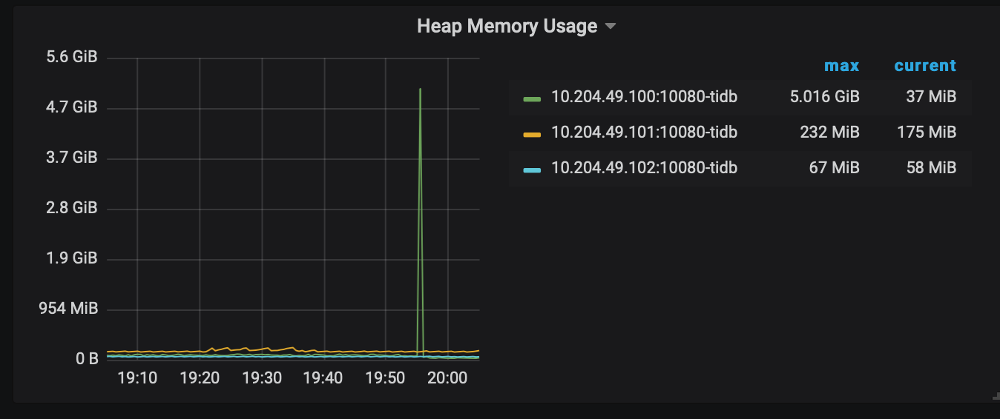


## 可能性能代码


我们看到延时高的地方是在tidb拉去tikv数据的时候发生的，从以上测试来看都是在`executor/`包下发生的问题。


